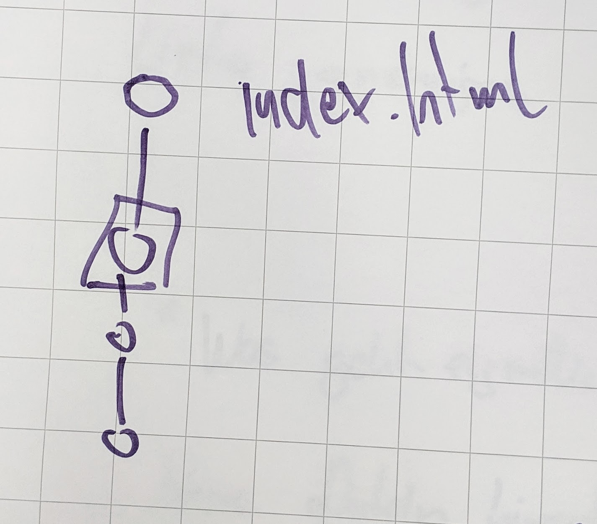

## What is Git?

Git is a tool for version control.

It is used for collaborative work on the same code base.

> If the team that programs the game Super Mario works together, one developer wants to edit the shape of the clouds, and another wants to change the color of the tubes. Git makes it easy that they can both work on the same code simultaneously.

All changes are saved in so-called *commits*.

Many commits make up the version history, or commit history.

Git is a software. It runs on the command line.

There are applications with a graphical user interface, but for this workshop, we learn the commands on the command line.

---

[Next](02-command-line-basics.md)