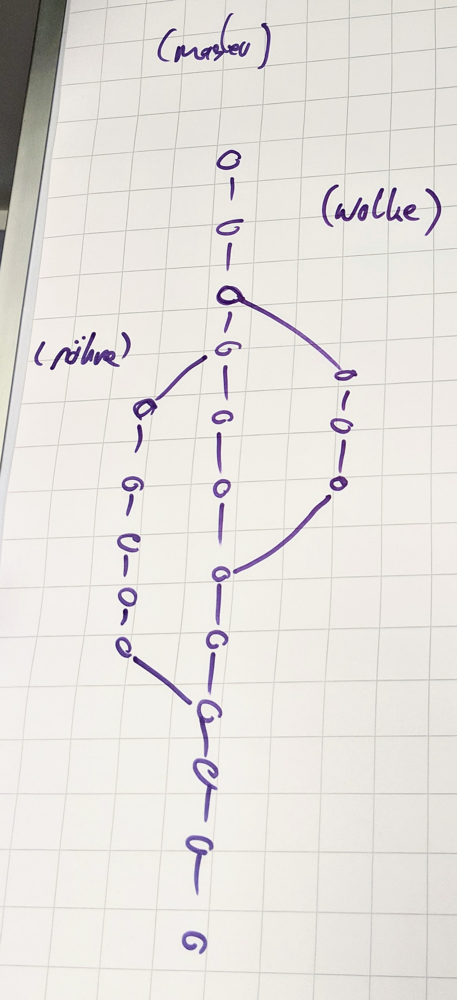

## Branches

Hallihallooooo!

If you want to collaborate on the same code base, you use branches, so everyone can commit changes independently.



> In the Super Mario development team, we have a current status of the published game. That's on the `master` branch.  
> The developer who wants to change the cloud, creates a `cloud` branch and makes his commits there.  
> The developer who wants to change the tube, creates a `tube` branch and makes his commits there.  
> When they are done, each developer merges his changes into the `master` branch.

This results in a commit history with multiple branches.

The master branch is usually the default branch.

If you want to make changes independently from the other developers, you create a branch. When you are done, these can be merged back to the master branch.

**Show all branches:**
```
git branch
```

**Create a new branch:**
```
git checkout -b <branch name>
```
If you want to create a branch called `feature`, you would type:
```
git checkout -b feature
```
The `-b` stands for "branch". This command is short for these two:
```
git branch feature
git checkout feature
```

**Move into an existing branch:**
```
git checkout <branch name>
```

**Merge branch `feature` into branch `master`:**  
First, you need to be on branch `master`.  
Then you can merge `feature` into `master` like this:
```
git merge feature
```

**Delete branch `feature`:**
```
git branch -d feature
```
You cannot delete a branch you are on. If you want to delete a branch, you need to be on a different branch.

If the branch is not fully merged yet, you get an error message. To delete the branch anyway, type:
```
git branch -D feature
```

---

[Next](06-revert-commits.md)
