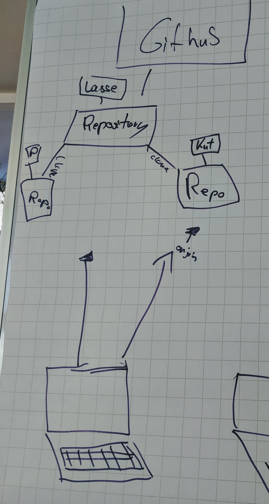

### GitHub

Git is a software.  
GitHub is a platform to host git repositories.

On GitHub, you can host your git repository.  
You can make it private (visible only for you) or public (visible for anyone, used for open source).

Git has a user interface that displays *diffs* and *commits* neatly.

### Repositories

A git repository is a project, or the root folder of your project.

If you used `git init` to initialize it, you created a repository.

What is *remote*?  
Remote is your server where you store your git repository.  
In our case, our remote is at GitHub. 

  

If you clone a repository, you create a local copy of it.

**Get a copy of your remote repository to your local machine:**
```
git clone <url of your remote repository>
```

**Upload an existing local repository to GitHub:**
```
git remote add origin <url to your GitHub repository>
```

**Show names of your remote servers:**
```
git remote show
```
In our case, this shows `origin`. This is the name or alias for our remote server.

---

[Next](09-push-and-pull.md)
