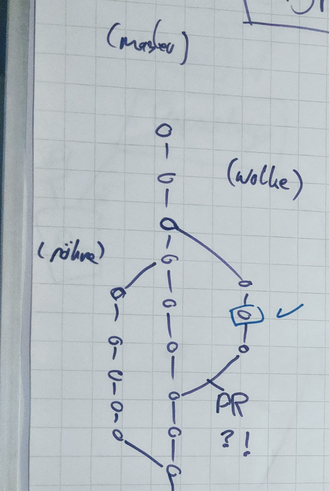

### Pull Requests

GitHub has a feature called *Pull Requests**. A pull request is a request to merge a branch back to master.

You can create a pull request only from within GitHub.

For example, if you pushed something to a new branch, on the main page of your GitHub repository, there will be a yellow button for creating a *Pull Request*.

---

[Next](11-github-pages.md)
